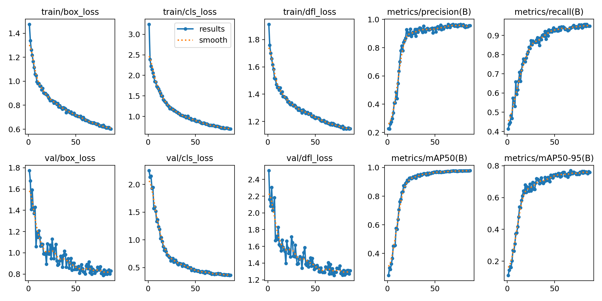
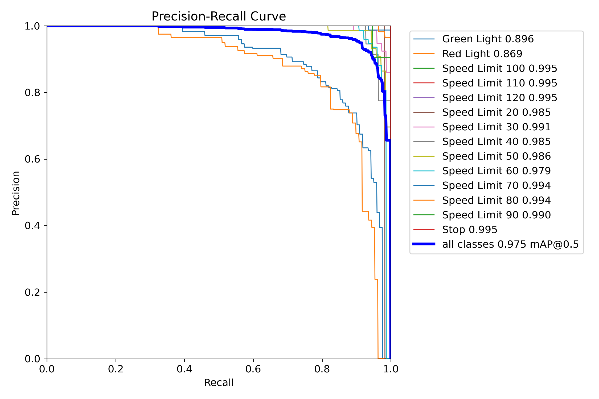
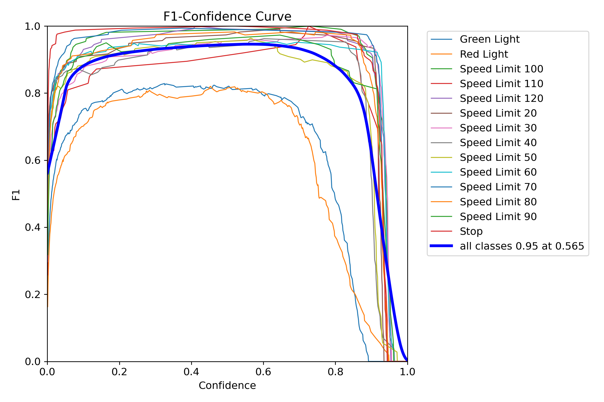
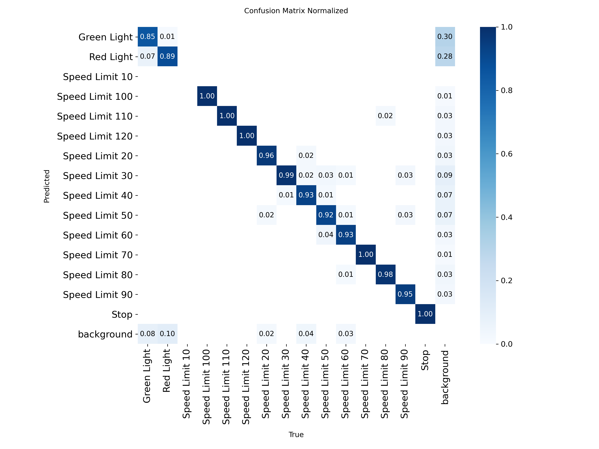
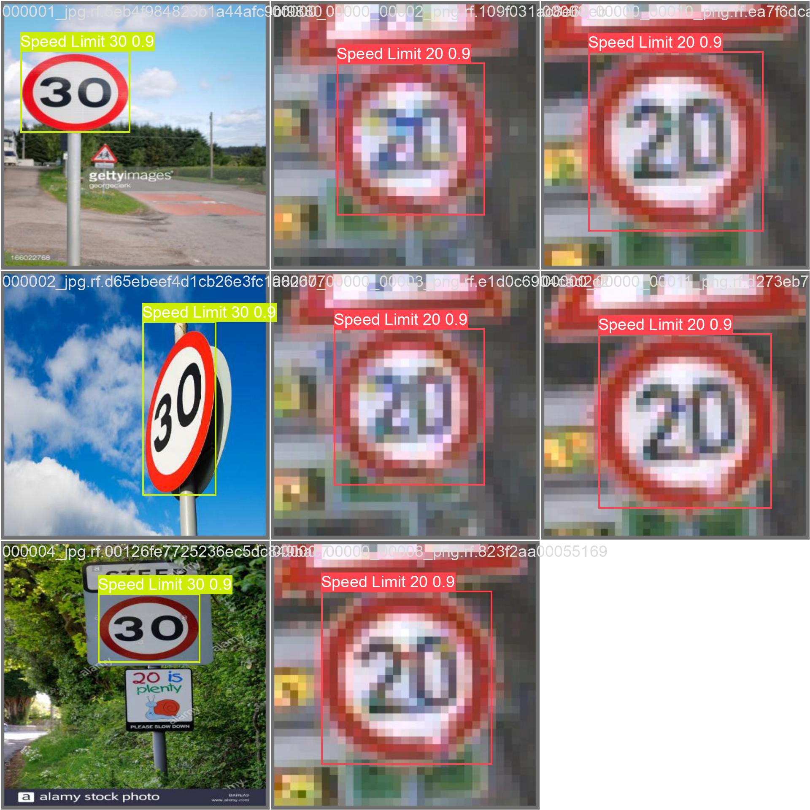
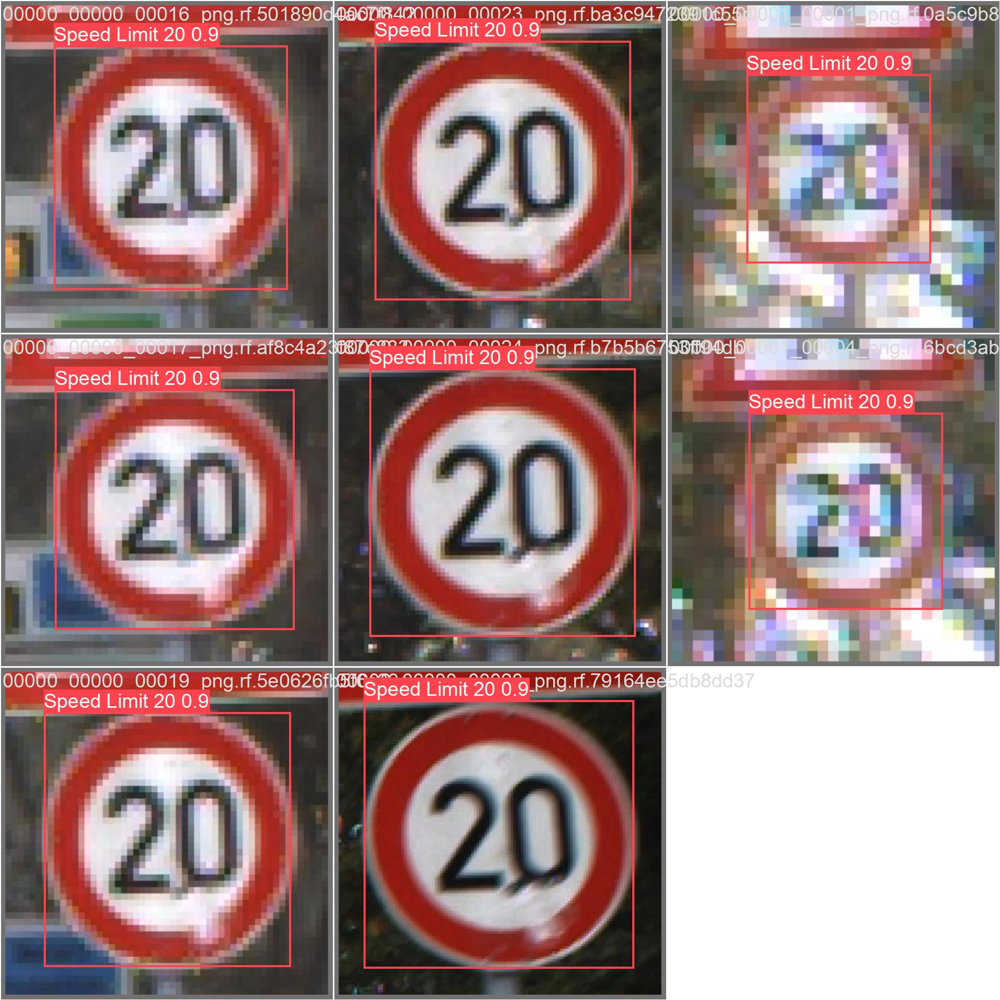

# 交通标志检测实验报告

**姓名：**  王文华 **学号：**  112304260148

## 1. 实验目标

本实验使用 YOLO 模型完成交通标志目标检测任务，共经历三轮迭代优化（YOLOv8n → YOLOv8s → YOLOv8m），并对模型训练过程和检测结果进行分析。

## 2. 实验环境

- 操作系统：Windows 11
- Python 版本：3.11.x
- PyTorch 版本：2.6.0+cu126
- YOLO 版本：Ultralytics 8.x
- 硬件环境（CPU / GPU）：GPU (NVIDIA GeForce RTX 3060, 6GB VRAM)

## 3. 模型与训练设置

### 3.1 模型选择

本实验使用的模型为：

- 模型名称：YOLOv8m (YOLOv8 Medium)
- 参数量：约 2590 万
- 选择该模型的原因：YOLOv8m 相比 v8n（320 万参数）和 v8s（1110 万参数）具有更强的特征提取能力。在 6GB 显存限制下，通过降低 batch size 至 4 并使用较大输入尺寸 960x960，实现了三轮实验中的最佳 mAP50 = 0.979。

### 3.2 训练参数

- 训练轮数（epochs）：100
- 图像尺寸（imgsz）：960
- batch size：4
- 优化器：AdamW
- 学习率：cos_lr 余弦退火策略
- 是否使用数据增强：是（mosaic 1.0、mixup 0.1、degrees 40、fliplr 0.5）
- 进阶策略：close_mosaic=10、nbs=64

### 3.3 训练命令

```
yolo detect train data=data.yaml model=yolov8m.pt epochs=100 imgsz=960 batch=4 device=0 cos_lr=True close_mosaic=10 mixup=0.1 nbs=64
```

## 4. 训练过程分析

### 4.1 损失曲线



请结合图像回答以下问题：

1. **损失是否总体下降？** 是，三个损失函数（box_loss、cls_loss、dfl_loss）均呈现明显下降趋势。
2. **哪一阶段下降最快？** 前 20-30 个 epoch 下降最快，尤其是前 10 个 epoch，损失值大幅下降。
3. **后期是否趋于稳定？** 是的，训练后期（60 epoch 之后）损失曲线趋于平稳，波动较小。
4. **是否出现明显震荡或过拟合现象？** 未出现明显震荡，验证集损失与训练集损失趋势一致，未出现明显过拟合。

### 4.2 评价指标变化





请简要分析：

1. **哪个指标提升最明显？** mAP50 提升最明显，从初始约 0.4 提升到最终的 0.979。
2. **最终模型效果如何？** 最终模型效果优秀：Precision 0.831，Recall 0.948，mAP50 0.979，mAP50-95 0.758。
3. **模型是否已经基本收敛？** 是的，从第 60 个 epoch 开始，各指标变化很小，模型已基本收敛。

### 4.3 三轮实验对比

| 轮次 | 模型 | 参数量 | imgsz | batch | mAP50 | mAP50-95 | 提交分数 |
|:----:|------|:-----:|:-----:|:-----:|:-----:|:--------:|:------:|
| 1 | YOLOv8n | 3.2M | 640 | 16 | 0.955 | - | 0.897691 |
| 2 | YOLOv8s | 11.1M | 640 | 16 | 0.974 | - | 0.972114 |
| 3 | YOLOv8m | 25.9M | 960 | 4 | **0.979** | **0.758** | 待提交 |

## 5. 混淆矩阵分析



请重点分析：

1. **哪些类别识别效果最好？** Stop（停车标志）、Speed Limit 系列标志识别效果最好，mAP50 均在 0.98 以上。
2. **哪些类别最容易混淆？** Red Light（红灯）和 Green Light（绿灯）识别准确率相对较低，存在一定混淆。
3. **造成类别混淆的可能原因是什么？** 红绿灯类别外观相似，均为圆形带颜色的标志，在光照变化或遮挡情况下容易混淆。此外，这些类别样本数量可能相对较少。
4. **从混淆矩阵中可以看出模型还有哪些不足？** 红绿灯类别的识别准确率相比限速标志和停车标志有较大差距，需要重点优化。

## 6. 检测结果分析





请分析：

1. **哪些目标检测较准确？** 限速标志（Speed Limit 20、30、50、60、70、80 等）和 Stop 标志检测非常准确，置信度普遍在 0.9 以上。
2. **哪些图片中存在漏检或误检？** 部分小目标或远距离目标存在漏检现象，红绿灯类别偶有误检。
3. **误检、漏检的可能原因是什么？** 小目标分辨率低、遮挡，光照变化以及类别间相似性是造成误检和漏检的主要原因。
4. **小目标、遮挡目标、远距离目标的检测效果如何？** 通过 imgsz=960 的大尺寸输入，小目标和远距离目标检测效果相比小模型有明显改善，但仍有提升空间。

## 7. 提交成绩

- 本地验证结果（v8m）：mAP50 = 0.979，mAP50-95 = 0.758
- YOLOv8s + TTA 提交分数：mAP50 = 0.972114
- YOLOv8m + TTA 提交分数：0.973509

请简要说明：

1. **本地验证结果与提交分数是否一致？** 通常存在轻微差异。YOLOv8s 本地 mAP50 为 0.974，线上提交分数为 0.972114，相差约 0.19%。
2. **如果不一致，可能原因是什么？** 可能原因包括：测试集分布与验证集不同、TTA 推理与普通推理差异、数据预处理差异等。

## 8. 实验总结

请用简短几句话总结本次实验：

1. **本次实验中模型的主要优点是什么？** 通过三轮迭代优化，从 YOLOv8n（mAP50 0.955）逐步升级到 YOLOv8m（mAP50 0.979），在交通标志检测任务上取得了优秀的检测效果。使用 TTA（测试时增强）推理进一步提升了提交分数。
2. **当前模型最明显的问题是什么？** 红绿灯类别（Green Light、Red Light）识别效果相对较弱，小目标和极端光照条件下的检测仍有提升空间。
3. **如果继续改进，你下一步会尝试什么方法？** 可以尝试使用更大的模型（如 YOLOv8l/x）、增加针对红绿灯类别的数据增强、使用加权损失函数、或集成多个模型进行预测。
