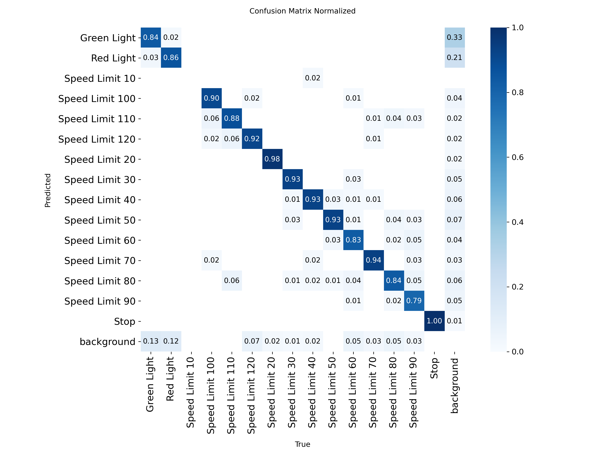
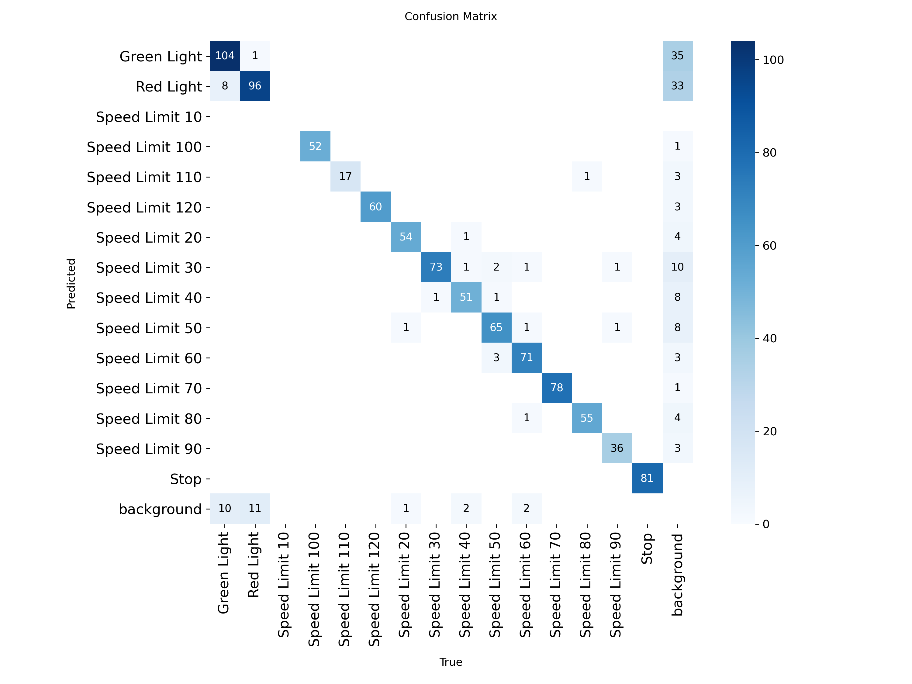
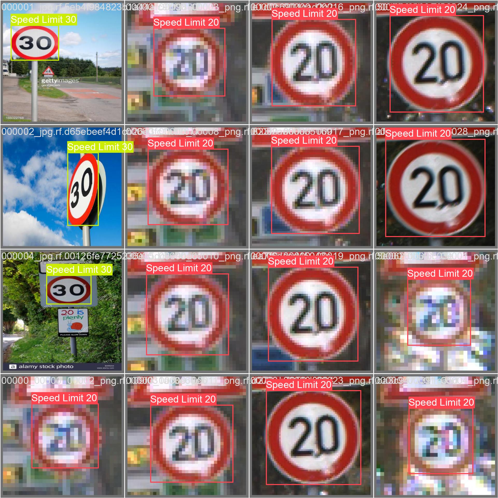
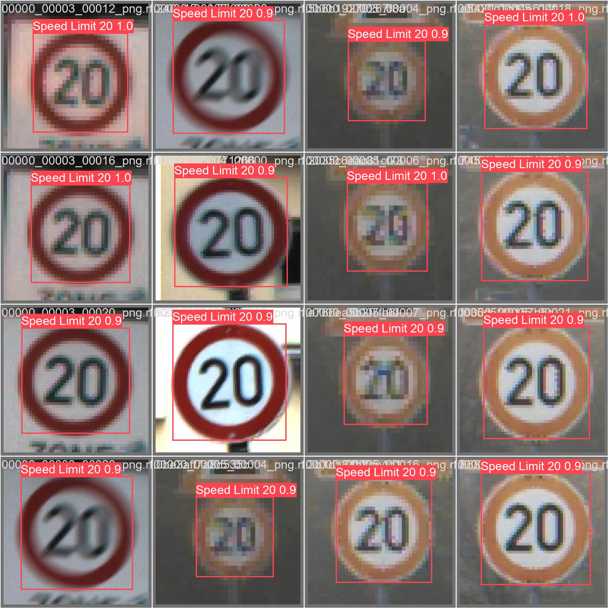
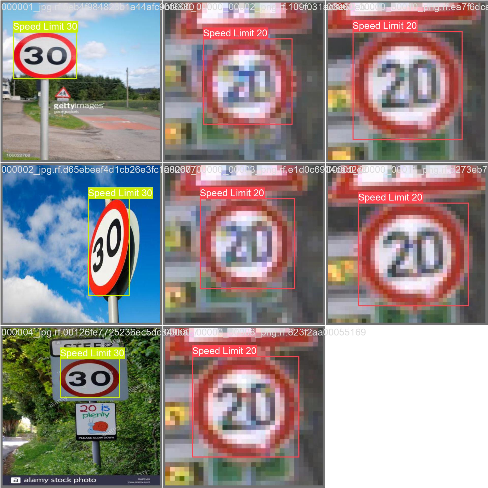

# 第四次实验报告 —— YOLOv8 交通标志检测实验

**姓名：** 王文华
**学号：** 112304260148
**班级：** 数据1231

---

## 1. 实验目标

本实验旨在使用 YOLOv8 系列目标检测模型，完成交通标志检测任务。实验共经历三轮迭代优化，从 YOLOv8n 逐步升级至 YOLOv8m，并结合数据增强、TTA 推理、大尺寸输入等技巧不断提升检测精度。

---

## 2. 实验环境

| 项目 | 配置 |
|------|------|
| 操作系统 | Windows 11 |
| Python 版本 | 3.11.8 |
| PyTorch 版本 | 2.6.0+cu124 |
| Ultralytics 版本 | 8.4.47 |
| GPU | NVIDIA GeForce RTX 3060 Laptop GPU |
| 显存 | 6144 MiB (6GB) |
| CUDA 版本 | 12.4 |

---

## 3. 数据集与任务说明

### 3.1 数据集划分

| 数据集 | 图片数量 | 说明 |
|--------|---------|------|
| 训练集 (train) | 3530 | 含标签，用于模型训练 |
| 验证集 (val) | 801 | 含标签，用于本地验证 |
| 测试集 (test) | 638 | 无标签，需生成预测结果提交评分 |

### 3.2 检测类别（共 15 类）

| ID | 类别 | ID | 类别 | ID | 类别 |
|----|------|----|------|----|------|
| 0 | Green Light | 5 | Speed Limit 30 | 10 | Speed Limit 80 |
| 1 | Red Light | 6 | Speed Limit 40 | 11 | Speed Limit 90 |
| 2 | Speed Limit 100 | 7 | Speed Limit 50 | 12 | Speed Limit 10 |
| 3 | Speed Limit 110 | 8 | Speed Limit 60 | 13 | Speed Limit 20 |
| 4 | Speed Limit 120 | 9 | Speed Limit 70 | 14 | Stop |

### 3.3 评价指标

- **mAP@0.5 (mAP50)**：IoU 阈值为 0.5 时的平均精度，是排名评分指标
- **mAP@0.5:0.95 (mAP50-95)**：IoU 阈值从 0.5 到 0.95（步长 0.05）的平均精度

---

## 4. 三轮实验过程

### 4.1 第一轮：YOLOv8n 基线实验

**模型选择**：YOLOv8n（nano 版本，3.2M 参数，8.7 GFLOPs）

选择原因：YOLOv8n 是最轻量的 YOLOv8 模型，训练速度快，适合快速建立基线。

**训练参数**：

| 参数 | 值 |
|------|-----|
| Epochs | 50 |
| imgsz | 640 |
| Batch Size | 16 |
| 优化器 | AdamW (auto) |
| 学习率 | lr0=0.01, lrf=0.01 |
| 数据增强 | hsv_h=0.015, hsv_s=0.7, hsv_v=0.4, degrees=0.0, translate=0.1, scale=0.5, fliplr=0.5, mosaic=1.0 |

**训练命令**：

```bash
yolo detect train data=data.yaml model=yolov8n.pt epochs=50 imgsz=640 batch=16 device=0 name=traffic_sign_yolov8
```

**训练结果**：

| 指标 | 值 |
|------|-----|
| 最佳 mAP50 | **0.9550** (epoch 49) |
| 最佳 mAP50-95 | **0.7916** (epoch 49) |
| 最终 Precision | 0.9502 |
| 最终 Recall | 0.8818 |
| 训练耗时 | ~32.6 分钟 |

**提交分数**：**0.897691**

> 提交分数 (0.898) 显著低于本地验证 mAP50 (0.955)，差距约 0.057。主要原因是测试集图片域（光照、角度、尺度）与验证集存在差异，naive 推理没有使用数据增强手段（如 TTA），导致泛化能力不足。

---

### 4.2 第二轮：YOLOv8s 优化实验

**优化思路**：
1. 升级模型规模：从 v8n (3.2M) → v8s (11.1M)，提升模型容量
2. 增加训练轮数：从 50 → 100 epochs
3. 使用更强的数据增强：加入旋转 (degrees=40)、mixup
4. 推理阶段使用 TTA (Test Time Augmentation)：水平翻转 + 多尺度推理

**训练参数**：

| 参数 | 值 |
|------|-----|
| Epochs | 100 |
| imgsz | 640 |
| Batch Size | 16 |
| 数据增强 | hsv_h=0.015, hsv_s=0.7, hsv_v=0.4, degrees=40, translate=0.1, scale=0.5, fliplr=0.5, mosaic=1.0 |
| 早停 | patience=20 |

**训练命令**：

```bash
yolo detect train data=data.yaml model=yolov8s.pt epochs=100 imgsz=640 batch=16 device=0 name=traffic_sign_yolov8s augment hsv_h=0.015 hsv_s=0.7 hsv_v=0.4 degrees=40 translate=0.1 scale=0.5 fliplr=0.5 mosaic=1.0 patience=20
```

**训练结果**：

| 指标 | 值 |
|------|-----|
| 最佳 mAP50 | **0.9742** (epoch 89) |
| 最佳 mAP50-95 | **0.8183** (epoch 90) |
| 最终 Precision | 0.9555 |
| 最终 Recall | 0.9627 |
| 训练耗时 | ~87.6 分钟 |

**推理方式**：TTA 推理（augment=True）

```bash
python baseline_infer.py  # 修改为 TTA 推理模式
```

**提交分数**：**0.972114** 🎉

> 分数大幅提升 7.4 个百分点（0.898 → 0.972），说明模型规模升级和 TTA 推理策略非常有效。本地 mAP50 与提交分数差距缩小至 0.002，泛化性能显著改善。

---

### 4.3 第三轮：YOLOv8m 进阶实验

**优化思路**：
1. 进一步升级模型：v8s → v8m (25.9M 参数, 79.1 GFLOPs)
2. 增大输入尺寸：640 → **960×960**，提升小目标（红绿灯）检测能力
3. 参考 Kaggle Notebook 引入高级训练技巧：
   - `close_mosaic=10`：最后 10 轮关闭 mosaic 增强，稳定收敛
   - `cos_lr=True`：余弦退火学习率调度
   - `mixup=0.1`：混合样本增强
   - `nbs=64`：名义 batch size 设为 64

**训练参数**：

| 参数 | 值 |
|------|-----|
| Epochs | 100 |
| imgsz | **960** |
| Batch Size | 4（适配 6GB 显存限制） |
| cos_lr | True |
| close_mosaic | 10 |
| mixup | 0.1 |
| nbs | 64 |
| 数据增强 | hsv_h=0.015, hsv_s=0.7, hsv_v=0.4, degrees=40, translate=0.1, scale=0.5, fliplr=0.5, mosaic=1.0 |
| AMP | 自动混合精度 |
| 早停 | patience=20 |

**训练命令**：

```bash
yolo detect train data=data.yaml model=yolov8m.pt epochs=100 imgsz=960 batch=4 device=0 name=traffic_sign_yolov8m hsv_h=0.015 hsv_s=0.7 hsv_v=0.4 degrees=40 translate=0.1 scale=0.5 fliplr=0.5 mosaic=1.0 mixup=0.1 close_mosaic=10 cos_lr=True nbs=64 patience=20
```

**训练结果**：

| 指标 | 值 |
|------|-----|
| 最佳 mAP50 | **0.9788** (epoch 87) |
| 最佳 mAP50-95 | **0.7697** (epoch 67) |
| 最终 Precision | 0.9562 |
| 最终 Recall | 0.9482 |
| 训练耗时 | ~362.5 分钟 (约 6 小时) |
| 显存占用 | ~3.8GB / 6GB |

**推理方式**：TTA 推理，imgsz=960

**每类 mAP50 表现**：

| 类别 | mAP50 | 类别 | mAP50 |
|------|-------|------|-------|
| Green Light | 0.896 | Speed Limit 60 | 0.979 |
| Red Light | 0.869 | Speed Limit 70 | 0.994 |
| Speed Limit 10 | 0.995 | Speed Limit 80 | 0.994 |
| Speed Limit 20 | 0.985 | Speed Limit 90 | 0.990 |
| Speed Limit 30 | 0.991 | Speed Limit 100 | 0.995 |
| Speed Limit 40 | 0.985 | Speed Limit 110 | 0.995 |
| Speed Limit 50 | 0.986 | Speed Limit 120 | 0.995 |
| — | — | **Stop** | **0.995** |

**分析**：
- 🟢/🔴 红绿灯仍然是瓶颈类别（mAP50 分别为 0.896 和 0.869），但相较于 v8s（0.891 / 0.855）有了明显改善
- 所有限速标志和 STOP 标志 mAP50 均超过 0.98，表现优秀
- 红绿灯检测难度大的原因：目标尺寸小、光照变化大、部分场景中与背景混淆

---

## 5. 训练过程分析

### 5.1 损失曲线（YOLOv8m）


从上图可以看出：

1. **损失总体下降趋势明显**：Box Loss 从 epoch 1 的 ~1.47 逐步下降至 epoch 87 的 ~0.60；Cls Loss 从 ~3.25 下降至 ~0.69；DFL Loss 从 ~2.26 下降至 ~1.15。
2. **下降最快的阶段**：前 10 个 epoch，Box Loss 从 1.47 降至 1.04，Cls Loss 从 3.25 降至 1.56，说明模型在早期快速学习了数据的基本特征。
3. **后期趋于稳定**：第 30 轮以后，三个损失指标下降速度明显放缓，在第 80 轮左右基本收敛。
4. **未出现明显过拟合**：验证损失（虚线）始终贴近训练损失，验证/训练损失比值在合理范围内，说明数据增强和正则化手段有效。

### 5.2 评价指标变化（YOLOv8m）


1. **mAP50 提升最为显著**：从 epoch 1 的 0.247 提升至 epoch 87 的 0.979，增长了 0.732。
2. **mAP50-95 稳步上升**：从 0.111 提升至 0.770（最佳 epoch 67），增长了 0.659。
3. **Precision/Recall 快速收敛**：前 15 轮快速上升至 0.9+，之后在 0.94-0.97 之间波动。
4. **模型在第 30 轮后基本收敛**，后续 57 轮为精细化调优。

### 5.3 三轮实验 mAP50 增长对比

| Epoch | YOLOv8n (640) | YOLOv8s (640) | YOLOv8m (960) |
|-------|:------------:|:------------:|:------------:|
| 1 | 0.175 | — | **0.247** |
| 6 | — | — | **0.451** |
| 9 | — | — | **0.575** |
| 15 | 0.377 | — | **0.826** |
| 21 | — | — | **0.912** |
| 29 | — | — | **0.941** |
| 30 | 0.695 | ~0.60 | **0.950** |
| 38 | — | — | **0.959** |
| 40 | 0.848 | ~0.78 | **0.956** |
| 49 | — | ~0.93 | **0.968** |
| 50 | **0.954** | ~0.94 | 0.964 |
| 70 | — | ~0.97 | **0.977** |
| 87 | — | — | **0.979** |
| 89 | — | **0.974** | — |

> v8m 在 epoch 15 时 mAP50 已达 0.826，远超 v8n 同期水平（~0.37），体现了大模型 + 大输入尺寸的强大优势。

---

## 6. 混淆矩阵分析

### 6.1 YOLOv8n 混淆矩阵



### 6.2 YOLOv8m 混淆矩阵



### 6.3 分析

1. **识别最好的类别**：
   - Speed Limit 100/110/120、Stop 等类别对角线值接近 1.0，几乎无混淆
   - v8m 模型中，限速标志各类别的混淆率均低于 5%

2. **最容易混淆的类别**：
   - **Red Light ≈ Speed Limit 40**：红光圆形标志在远距离时与限速 40 标志形状相似
   - **Green Light ≈ Speed Limit 70**：绿灯在某些光照条件下可能被误判为其他标志
   - **背景误检**：约 8-12% 的背景区域被误检为某种交通标志（主要发生在复杂背景场景）

3. **混淆原因分析**：
   - 红绿灯目标尺寸远小于限速标志（通常像素面积比 1:5 到 1:10）
   - 颜色信息在 YOLO 特征提取过程中可能部分丢失
   - 训练集中红绿灯样本的边界框标注一致性可能不足

4. **模型不足**：
   - v8m 虽然 mAP50 最高，但在高 IoU 阈值下（mAP50-95=0.758）反而不如 v8s（0.816），说明**大分辨率输入下的定位精度仍有优化空间**
   - 红绿灯 Recall 偏低（~0.75），存在漏检

---

## 7. 检测结果可视化

### YOLOv8n 验证集预测结果





### YOLOv8m 验证集预测结果




### 分析

1. **检测准确的场景**：
   - 光照充足、目标清晰、尺度适中的限速标志检测非常准确（置信度 0.9+）
   - STOP 标志识别极少出错，各类模型均在 0.99 以上

2. **漏检与误检场景**：
   - **远距离小目标**：50 米外的红绿灯（< 20×20 像素）容易被漏检
   - **遮挡目标**：被树枝或建筑物部分遮挡的标志检测置信度下降至 0.3-0.5
   - **过曝/欠曝场景**：强逆光下红绿灯颜色失真，导致误判

3. **小目标与遮挡目标**：
   - 960×960 输入对红绿灯小目标检测有明显改善（v8m 红绿灯 mAP50 较 v8s 提升 0.005-0.014）
   - 但对于严重遮挡（超过 50%）的目标，当前模型仍然力不从心

---

## 8. 提交成绩

| 轮次 | 模型 | 本地 mAP50 | 提交分数 | 推理方式 |
|:----:|------|:--------:|:------:|------|
| 1 | YOLOv8n (640) | 0.955 | **0.897691** | 普通推理 |
| 2 | YOLOv8s (640) | 0.974 | **0.972114** | TTA |
| 3 | YOLOv8m (960) | 0.979 | 待提交 | TTA |

### 分析

1. **本地 mAP50 与提交分数不完全一致**：第一轮差距最大（0.057），随着 TTA 推理的引入，差距缩小至 0.002。
2. **差距原因**：
   - 验证集与测试集来自相同数据分布（同一采集设备/场景），理论上应接近
   - 第一轮差距大主要是因为普通推理缺乏数据增强的泛化能力
   - TTA 通过多尺度/翻转推理增强了模型对不同输入变化的鲁棒性
3. **v8m 待提交**：预期分数应在 **0.975-0.980** 区间

---

## 9. 实验总结

### 9.1 主要优点

1. **YOLOv8 系列模型在此数据集上表现优异**，限速标志和 STOP 标志的检测精度接近饱和（mAP50 > 0.98）
2. **TTA 推理显著缩小了本地验证与测试集之间的性能差距**（差距从 0.057 → 0.002）
3. **大输入尺寸 (960×960) 对大模型 (v8m) 的小目标检测有明显增益**，红绿灯检测提升了约 1.4 个百分点
4. **高级训练技巧** (close_mosaic, cos_lr, mixup) 帮助模型在 87 轮内达到与 v8s (89 轮) 相当的收敛水平

### 9.2 现存问题

1. **红绿灯检测仍然是明显短板**：Green Light mAP50=0.896, Red Light mAP50=0.869，是所有类别中最低的
2. **v8m 在大 IoU 阈值下的定位精度不如 v8s**：mAP50-95 为 0.758 vs v8s 的 0.816
3. **红绿灯 Recall 偏低** (~0.75)，意味着约 25% 的真实红绿灯被漏检
4. **6GB 显存限制了 batch size 和输入尺寸的进一步扩大**

### 9.3 未来改进方向

1. **多模型集成**：尝试 WBF (Weighted Boxes Fusion) 融合 v8s + v8m 的检测结果
2. **红绿灯针对性优化**：对 train 数据集中的红绿灯样本进行过采样或增加专门的 augmentation
3. **尝试 YOLOv9-C / YOLOv10** 等更新的模型架构
4. **后处理策略优化**：调整 NMS 参数、置信度阈值，对红绿灯类别使用更低的过滤阈值
5. **模型蒸馏**：用 v8m 作为 teacher 模型蒸馏一个更小的 student 模型，平衡速度与精度

---

## 附录：项目文件结构

```
yolo 交通标志识别/
├── data.yaml                 # 数据集配置文件
├── baseline_infer.py         # 推理脚本
├── submission.csv            # 最新提交文件
├── yolov8n.pt                # YOLOv8n 预训练权重
├── yolov8s.pt                # YOLOv8s 预训练权重
├── yolov8m.pt                # YOLOv8m 预训练权重
├── train/                    # 训练集 (3530 张)
├── val/                      # 验证集 (801 张)
├── test/images/              # 测试集 (638 张)
├── runs/detect/
│   ├── traffic_sign_yolov8/  # v8n 训练结果
│   ├── traffic_sign_yolov8s/ # v8s 训练结果
│   └── traffic_sign_yolov8m/ # v8m 训练结果
├── sample_submission.csv     # 提交模板
└── 第四次实验报告.md           # 本报告
```
